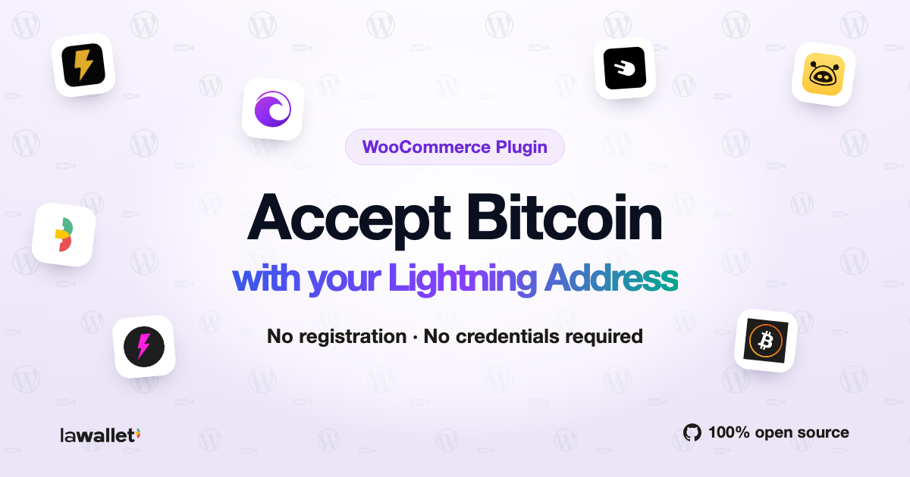

# LaWallet - Wordpress



LaWallet - Wordpress combines two Lightning features in one WordPress plugin:

1. WooCommerce checkout payments through a merchant Lightning Address with LNURL-pay, LUD-21 backend verification, NIP-57 fast detection, Yadio fiat conversion, and WebLN support.
2. LaWallet Lightning Address and NIP-05 discovery for site users by redirecting `/.well-known/*` requests to a configured LaWallet API gateway.

The WooCommerce gateway creates a Lightning invoice during checkout, stores the invoice and LUD-21 verify URL on the order, shows a QR/payment link to the customer, then verifies settlement server-side before marking the order paid. NIP-57 zap receipts and WebLN can speed up browser detection, but the backend always confirms with LUD-21 before completing the order.

The discovery option is based on `lawalletio/lawallet-wordpress`: it adds a settings page under `Settings -> LaWallet`, verifies the configured gateway with `/.well-known/nostr.json?name=_`, registers a WordPress rewrite for `/.well-known/*`, and redirects discovery requests with HTTP `307`.

Install or download the plugin from [WordPress.org](https://wordpress.org/plugins/lawallet-lightning-address/).

## Local Development

Start WordPress, WooCommerce, and the mock Lightning/LaWallet provider:

```sh
make up
make setup
```

Open WordPress at [http://localhost:8080](http://localhost:8080).

Admin credentials:

```text
user: admin
pass: password
```

The local setup configures:

```text
WooCommerce merchant Lightning Address: merchant@mock-lnurl:4000
LaWallet discovery gateway: http://mock-lnurl:4000
```

The mock provider is available on [http://localhost:4000](http://localhost:4000). It implements LNURL-pay, returns a LUD-21 `verify` URL, publishes mock NIP-57 receipts over `ws://localhost:4000/nostr`, and serves mock NIP-05 responses for discovery verification.

Run the end-to-end checkout and discovery test:

```sh
make e2e
```

## Production Notes

- Configure WooCommerce payments under `WooCommerce -> Settings -> Payments -> LaWallet - Wordpress`.
- Configure Lightning Address/NIP-05 discovery under `Settings -> LaWallet`.
- The merchant Lightning Address must support LNURL-pay and return a LUD-21 `verify` URL in invoice callback responses.
- If the provider exposes `allowsNostr: true` and `nostrPubkey`, the plugin requests a zap invoice and listens for NIP-57 receipts to claim faster in the browser.
- The LUD-21 verify response is the settlement authority. Relay receipts never mark an order paid by themselves.
- Pending Lightning orders are checked by WordPress cron. Paid orders are completed; expired unpaid orders are cancelled.
- For non-BTC store currencies, the gateway uses Yadio BTC exchange rates by default. A manual sats-per-currency-unit setting is available for controlled environments.
- Discovery redirects requests like `https://example.com/.well-known/lnurlp/alice` and `https://example.com/.well-known/nostr.json?name=alice` to the configured LaWallet gateway.

Primary protocol references used:

- [LUD-06 LNURL-pay](https://github.com/lnurl/luds/blob/luds/06.md)
- [LUD-21 verify](https://github.com/lnurl/luds/blob/luds/21.md)
- [NIP-57 Lightning Zaps](https://github.com/nostr-protocol/nips/blob/master/57.md)
- [NIP-05 Mapping Nostr keys to DNS-based internet identifiers](https://github.com/nostr-protocol/nips/blob/master/05.md)
